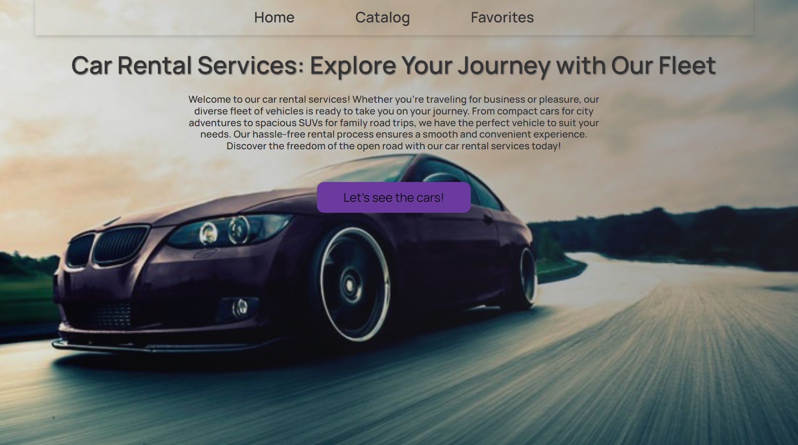

Car Rental Service Application
Welcome to the Car Rental Service Application! Our platform provides a seamless experience for renting cars in Ukraine. Below, you'll find descriptions of the three main sections of our application, each designed to make your car rental experience easy and enjoyable.

Home Page
Overview: The home page is your gateway to the world of car rentals. Our website is designed with your convenience in mind, allowing you to access information about our offerings effortlessly.

Style and Design: Our website features a sleek and modern design that is both visually appealing and user-friendly. The use of  intuitive navigation ensures that you'll have a pleasant browsing experience.

Car Catalog
Explore Our Fleet: Our car catalog is the heart of our application, featuring a wide range of vehicles with varying specifications. You can easily filter and find the perfect car for your needs.

Visual Presentation: You can click on a car to view more information, including rental options, specifications, and user ratings.

Favorite Listings
Your Saved Listings: This section allows you to save your favorite car listings for easy access later. If you find a car you love but aren't ready to book, simply add it to your favorites.

Convenient Organization: Your saved listings are neatly organized, making it simple to compare and decide on the perfect car for your upcoming rental.

Effortless Experience: Our user-friendly interface ensures that managing your favorite listings is hassle-free, allowing you to focus on planning your next adventure.

Thank you for choosing us as your car rental partner. Happy exploring!

